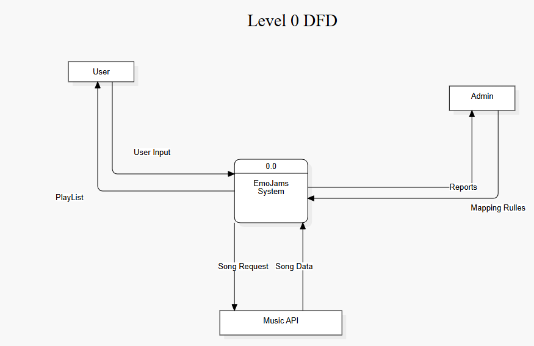
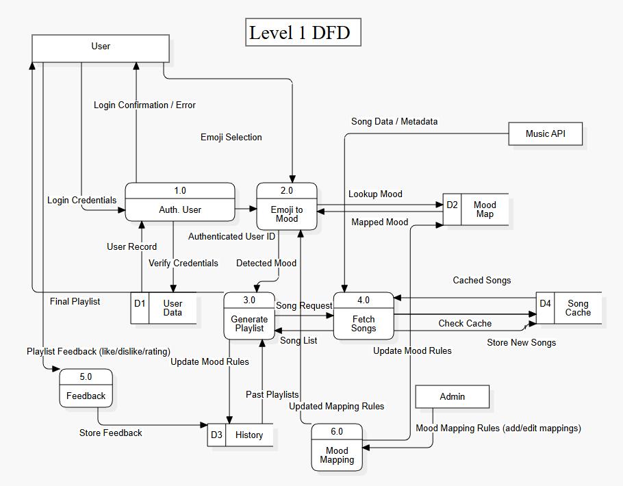

# 🎵 EmoJams – Data Flow Diagram (DFD)

## Aim

To design **Level 0 and Level 1 Data Flow Diagrams (DFDs)** for the **EmoJams** music playlist generation system using StarUML.

## Objective

The objectives of this practical are:

* To understand the concept of Data Flow Diagrams.
* To represent the flow of data within the EmoJams system.
* To identify external entities interacting with the system.
* To represent the major processes involved in EmoJams.
* To identify the data stores required by the system.
* To decompose the main system into detailed processes using a Level 1 DFD.

## Introduction

A **Data Flow Diagram (DFD)** is a graphical representation of how data moves through a system.

It shows:

* Where data comes from.
* How data is processed.
* Where data is stored.
* Where processed data is sent.

DFDs help developers and stakeholders understand the logical flow of information within a system without focusing on programming implementation details.

For **EmoJams**, the DFD represents how user inputs, particularly selected emojis, are processed to generate personalized music playlists.

## About EmoJams

**EmoJams** is a music playlist generator that recommends songs based on emojis selected by the user.

The system accepts user information and emoji selections as input, analyzes the associated mood or emotion, processes the information, and generates suitable music recommendations.

The system can also manage user profiles, playlists, favorites, and listening history.

## DFD Levels

The EmoJams system is represented using two levels of DFD:

### Level 0 DFD

The Level 0 DFD provides a high-level view of the complete EmoJams system.

It represents the system as a single major process and shows its interaction with external entities.

It focuses on:

* External entities.
* Main system.
* Input data.
* Output data.

### Level 1 DFD

The Level 1 DFD provides a more detailed representation of the EmoJams system.

The main system represented in Level 0 is decomposed into smaller processes to show how different types of data are handled internally.

## DFD Symbols Used

| Symbol                            | Meaning         |
| --------------------------------- | --------------- |
| Rectangle                         | External Entity |
| Circle / Process                  | Process         |
| Open-ended Rectangle / Data Store | Data Store      |
| Arrow                             | Data Flow       |

## Level 0 DFD – Context Diagram

The **Level 0 DFD** represents the EmoJams system at a high level.

It shows how the external user interacts with the complete EmoJams system through different inputs and outputs.

### 📸 Level 0 DFD Screenshot

**ADD YOUR LEVEL 0 DFD SCREENSHOT HERE**

> Replace the line above with your image after uploading it to the GitHub repository.

For example:

### Main Components

**External Entity:**

* User

**Main Process:**

* EmoJams Music Playlist Generator

**Major Input Data:**

* User information.
* Login information.
* Selected emojis.
* Music preferences.

**Major Output Data:**

* Personalized playlists.
* Recommended songs.
* Playlist information.
* User-related results.

### Level 0 Data Flow

The general flow of information can be represented as:
### Level 0 DFD

The Level 0 diagram provides an overall understanding of the interaction between the user and the EmoJams system.

## Level 1 DFD

The **Level 1 DFD** decomposes the main EmoJams system into multiple processes.
### Level 1 DFD

It provides a detailed view of how information is processed inside the system.

### Main Processes

The Level 1 DFD represents the major internal processes of the EmoJams system.

### 1. User Management

This process handles user-related operations such as:

* User registration.
* User login.
* Profile management.
* Authentication.

### 2. Emoji and Mood Analysis

This process receives the emojis selected by the user and determines their associated mood or emotional category.

For example:
😊 → Happy
😢 → Sad
❤️ → Love
🔥 → Excited
😌 → Relaxed

The identified mood is then used for playlist generation.

### 3. Playlist Generation

This process uses the identified mood and user preferences to generate a suitable playlist.

The system can provide:

* Recommended songs.
* Song details.
* Personalized playlists.

### 4. Music Management

This process handles music-related operations such as:

* Playing songs.
* Pausing songs.
* Skipping songs.
* Shuffling playlists.
* Repeating playlists.

### 5. Favorites and History Management

This process manages user activity such as:

* Favorite songs.
* Favorite playlists.
* Recently played songs.
* Listening history.

## Data Stores

The Level 1 DFD uses data stores to maintain information required by the EmoJams system.

### User Data

Stores information related to registered users and their profiles.

### Emoji/Mood Data

Stores emoji information and its associated mood or emotion.

### Playlist Data

Stores generated and saved playlists.

### Song Data

Stores information related to songs, artists, albums, and genres.

### Listening History

Stores information about recently played songs and user activity.

## Data Flow in Level 1

The general flow of information can be represented as:

text
User
  │
  ▼
User Management
  │
  ▼
User Data
  │
  ▼
Emoji & Mood Analysis
  │
  ▼
Mood Information
  │
  ▼
Playlist Generation
  │
  ▼
Playlist Data
  │
  ▼
Recommended Playlist
  │
  ▼
User

The user can then interact with the generated playlist and perform activities such as playing songs, saving favorites, and maintaining listening history.

## Relationship Between Level 0 and Level 1

Level 0 and Level 1 DFDs represent the same EmoJams system at different levels of detail.

| Level 0 DFD                              | Level 1 DFD                                   |
| ---------------------------------------- | --------------------------------------------- |
| High-level representation                | Detailed representation                       |
| Shows the complete system as one process | Decomposes the system into multiple processes |
| Shows external interaction               | Shows internal data processing                |
| Simple representation                    | Detailed representation                       |
| Useful for overall understanding         | Useful for system analysis and design         |

The Level 1 DFD provides further details about the system represented by the single process in the Level 0 DFD.

## Tools Used

**Tool:** StarUML

StarUML was used to design and create the Level 0 and Level 1 DFDs for the EmoJams system.

## Advantages of DFD

DFDs provide several advantages:

* Easy to understand.
* Clearly represent data movement.
* Help identify system processes.
* Help identify data stores.
* Improve communication between developers and stakeholders.
* Assist during system analysis and design.
* Provide a foundation for further system development.
* Make complex systems easier to understand.

## Applications of DFD in EmoJams

The DFD helps in understanding:

* How users interact with EmoJams.
* How emoji selections enter the system.
* How mood information is processed.
* How playlists are generated.
* How user information is stored.
* How favorites and listening history are maintained.
* How information flows between different parts of the system.

## Conclusion

The Level 0 and Level 1 Data Flow Diagrams provide a structured representation of the **EmoJams** system.

The Level 0 DFD provides a high-level overview of the interaction between the user and the EmoJams system, while the Level 1 DFD provides a more detailed view of the internal processes and data movement.

Creating these DFDs using StarUML helps in understanding the system requirements, identifying processes and data stores, and establishing a clear foundation for the design and development of EmoJams.

