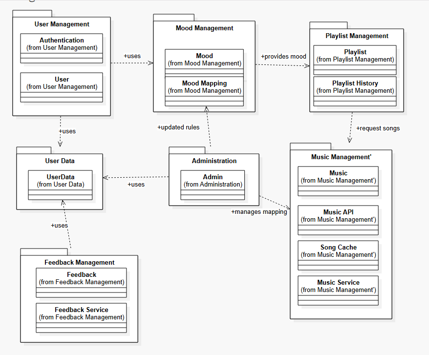

🎵 EmoJams -- UML Package Diagram

**Aim**

To study and draw a UML Package Diagram for the EmoJams music
playlist generation system using StarUML.

**Objective**

The objectives of this practical are:

To understand the concept of UML Package Diagrams.

To identify and organize related classes into packages.

To represent the modular structure of the EmoJams system.

To identify dependencies between different packages.

To understand how different modules interact with each other.

To represent the structural organization of the EmoJams system using
UML.

**Introduction**

A UML Package Diagram is a structural diagram used to organize
related elements of a software system into packages. It shows packages
or modules, the classes contained within them, and dependencies between
different packages. Package diagrams help developers understand how a
large software system is divided into smaller and manageable modules.
For EmoJams, the package diagram represents the organization of user
management, mood management, playlist management, music management, user
data, administration, and feedback-related functionalities.

**About EmoJams**

EmoJams is a music playlist generator that recommends songs based on
emojis selected by the user. The system identifies the mood associated
with the selected emojis and uses the mood to provide suitable music
recommendations and generate playlists. The system also supports user
authentication, user data management, playlist history, music services,
administration, and feedback management.

**UML Package Structure**

1. User Management

This package handles user-related operations such as user
authentication, user information, and account management.

Classes: * Authentication * User

2. Mood Management

This package manages mood-related operations and the mapping between
emojis and moods.

Classes: * Mood * Mood Mapping

3. Playlist Management

This package handles the creation and management of playlists.

Classes: * Playlist * Playlist History

4. User Data

This package stores and manages information related to users.

Class: * UserData

5. Administration

This package provides administrative functionality.

Class: * Admin

The administrator can manage system information and update mood-mapping
rules.

6. Music Management

This package handles music-related operations and services.

Classes: * Music * Music API * Song Cache * Music Service

7. Feedback Management

This package handles feedback provided by users.

Classes: * Feedback * Feedback Service

**Package Dependencies**

From Package          To Package            Dependency

User Management       Mood Management       Uses
User Management       User Data             Uses
Mood Management       Playlist Management   Provides mood
Playlist Management   Music Management      Requests songs
Administration        Mood Management       Updates rules
Administration        User Data             Uses
Feedback Management   User Data             Uses
Administration        Music Management      Manages mapping

**UML Package Diagram**

The following diagram represents the package structure and dependencies
of the EmoJams system.

**Package Diagram Explanation**

The User Management package handles authentication and user-related
functionality. It uses the Mood Management package for mood-related
processing and the User Data package for user information.

The Mood Management package contains Mood and Mood Mapping. It
provides mood information to the Playlist Management package.

The Playlist Management package contains Playlist and
Playlist History. It requests suitable songs from the Music
Management package.

The Administration package contains the Admin class and can update
mood-mapping rules.

The Music Management package contains music-related classes such as
Music, Music API, Song Cache, and Music Service.

The Feedback Management package contains Feedback and
Feedback Service and uses user data for associating feedback with
users.

**Relationships Between Packages**

User Management
      │
      ├── uses ──> Mood Management
      │                 │
      │                 └── provides mood ──> Playlist Management
      │                                             │
      │                                             └── requests songs ──> Music Management
      │
      └── uses ──> User Data

Administration
      ├── updates rules ──> Mood Management
      ├── uses ───────────> User Data
      └── manages mapping ─> Music Management

Feedback Management
      └── uses ──> User Data

Tools Used

Tool: StarUML

StarUML was used to design and create the UML Package Diagram for the
EmoJams system.

Advantages of UML Package Diagram

Package diagrams provide several advantages:

Organize related classes into packages.

Make the system structure easy to understand.

Show dependencies between modules.

Improve system modularity.

Make large systems easier to manage.

Help developers understand system architecture.

Support easier maintenance and future development.

Reduce complexity by grouping related functionalities.

Applications of Package Diagram in EmoJams

The package diagram helps in understanding:

How user-related classes are organized.

How mood-related functionality is separated.

How playlists are managed.

How music services are organized.

How user data is maintained.

How administrative functions interact with other modules.

How feedback functionality is connected to user data.

How different modules depend on each other.

**Output Analysis**

The UML Package Diagram clearly represents the structural organization
of the EmoJams system. The related classes are grouped into
appropriate packages such as User Management, Mood Management, Playlist
Management, User Data, Administration, Music Management, and Feedback
Management. The dependencies between the packages show how different
modules interact with each other. The diagram provides a modular and
organized representation of the system, making it easier to understand,
maintain, and extend.

**Conclusion**

The UML Package Diagram for the EmoJams system was successfully
designed. The system was divided into appropriate packages containing
related classes, and the dependencies between the packages were
represented. The package diagram provides a clear and structured view of
the organization of the EmoJams system and shows how its different
modules interact with each other.
